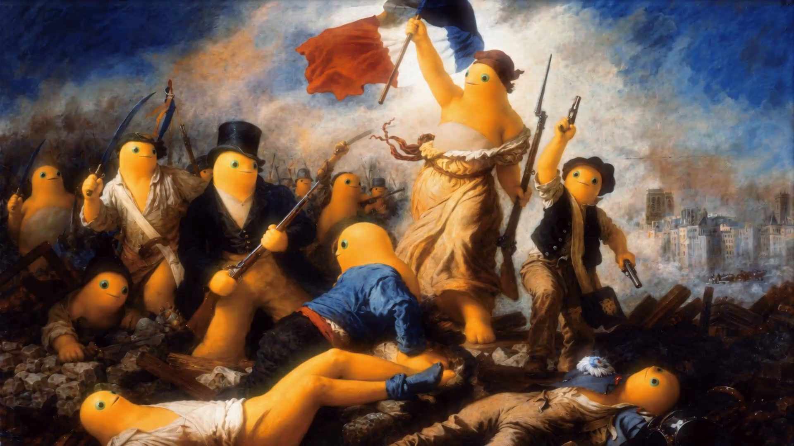
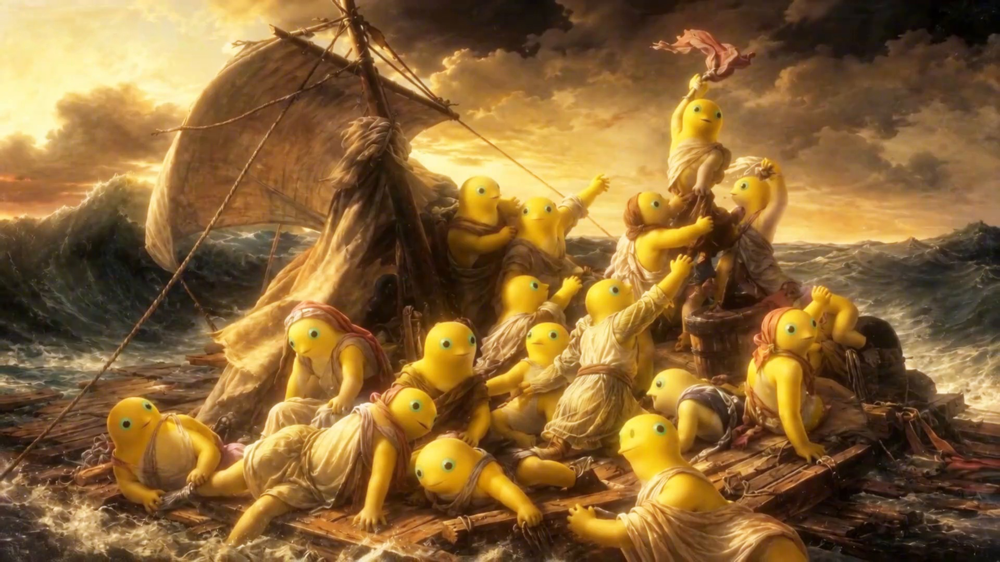
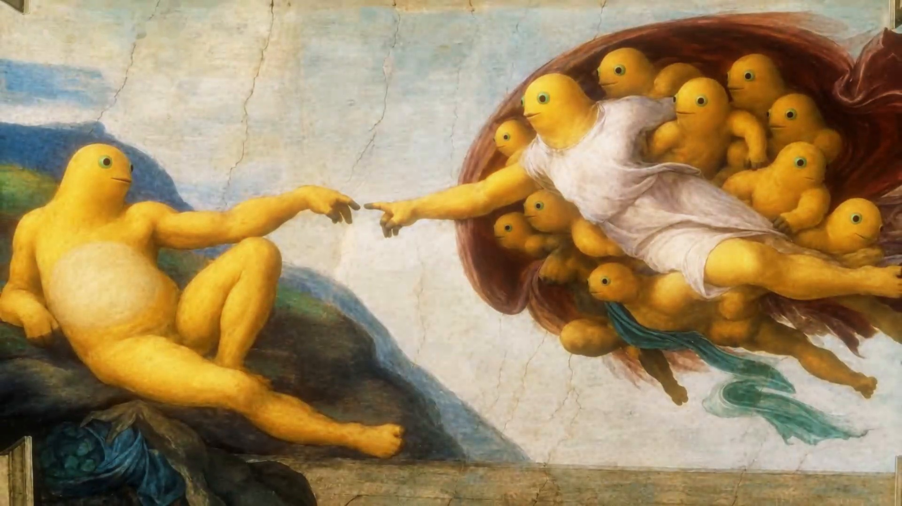

# Nailong Wallpaper · 奶龙壁纸库

> 换壁纸一时爽，一直换一直爽。98 张精选奶龙壁纸（22 张卡片 + 38 张名画 + 9 张特别艺术 + 29 张竖屏），让你的桌面变成奶龙的窝。

从 [Nailong-Studio/NaiLong-Universe](https://github.com/Nailong-Studio/NaiLong-Universe) 分离的独立壁纸仓库，开箱即用，按分辨率分目录存放。

## 预览

<p align="center">
  
  
  
</p>

<p align="center">
  
  
  
</p>

## 已有壁纸

| 目录 | 数量 | 风格 | 分辨率 | 说明 |
| --- | --- | --- | --- | --- |
| `fullhd/` | 22 张 | 卡片海报风 | 1920×1080 | **原图直出**，一像素都不裁剪、不抠图、不P图，四周空白用原图背景色填充 |
| `classic/` | 38 张 | 名画系列 | 1920×1080 为主 | 世界名画，奶龙主演 ——《自由引导奶龙》《奶龙之筏》《创造奶龙》等 38 幕，油画质感 |
| `special/` | 9 张 | 特别艺术补充 | 1882×1080 / 1280×720 | 奶蛙的永恒 + 孤独奶龙主义 8 幕，同人二创无损 PNG，已做无痕去水印 |
| `phone/` | 29 张 | 竖屏手机壁纸 | 1080×1920 | 最伟大的奶龙 29 帧抽取，无损 PNG，适配手机竖屏 |

```
.
├── fullhd/     # 22 张 · 卡片海报风 · 1920x1080 原图直出
├── classic/    # 38 张 · 名画系列 · 油画质感，奶龙当主角
├── special/    # 9 张 · 特别艺术补充 · 奶蛙/孤独奶龙主义等外传
├── phone/      # 29 张 · 竖屏手机壁纸 · 1080x1920 最伟大的奶龙
├── 4k/         # 3840x2160，适配 4K 显示器（待产）
├── 2k/         # 2560x1440，适配 2K 显示器（待产）
├── dualscreen/ # 双屏拼接壁纸（待产）
└── scripts/    # 壁纸生成脚本
```

> `classic/` 约 15MB，`fullhd/` 约 2.9MB，`special/` 约 11MB，`phone/` 约 66MB，合计约 95MB。

## 快速开始

直接下载你喜欢的分辨率，或克隆整个仓库：

```bash
git clone https://github.com/Nailong-Studio/wallpaper.git
```

## 生成壁纸

壁纸由 [`scripts/make_wallpapers.py`](scripts/make_wallpapers.py) 生成，原图完整等比缩放居中放置，背景用原图自身颜色填充，100% 保留原图内容。

```bash
# 用法: python3 scripts/make_wallpapers.py <表情目录> <输出目录> [宽度] [高度]
python3 scripts/make_wallpapers.py /path/to/emotes fullhd 1920 1080
python3 scripts/make_wallpapers.py /path/to/emotes 4k 3840 2160
```

依赖：`Pillow`

```bash
pip install Pillow
```

## 安装

### Windows

1. 下载目标分辨率壁纸
2. 右键图片 -> 设为桌面背景
3. 或统一放入 `C:\Windows\Web\Wallpaper`（需管理员权限）后在"个性化"中选择

### macOS

1. 下载壁纸
2. 右键图片 -> 设定为桌面图片
3. 或打开"系统设置 -> 壁纸"，将图片拖入窗口

### Linux (GNOME)

```bash
gsettings set org.gnome.desktop.background picture-uri "file:///绝对路径/图片.jpg"
gsettings set org.gnome.desktop.background picture-uri-dark "file:///绝对路径/图片.jpg"
```

## 命名规范

- `fullhd/` 建议格式：`nailong-<编号>.jpg`，编号与表情素材库一一对应
- `classic/` 保留原名画标题，如 `自由引导奶龙.jpg`

## 贡献

欢迎投喂壁纸：

- 上传前请将图片裁剪/生成为对应目录的分辨率
- 保持视觉风格统一（奶龙主题色、色调一致）
- 禁止上传版权受限或付费素材
- 提交 PR 请附预览图

## 相关仓库

- 主宇宙：[Nailong-Studio/NaiLong-Universe](https://github.com/Nailong-Studio/NaiLong-Universe) - 奶龙主题全家桶（主题、终端配色、表情包）
- 本仓库：[Nailong-Studio/wallpaper](https://github.com/Nailong-Studio/wallpaper) - 独立壁纸库

## 版权声明

- 奶龙角色形象版权归其版权方所有，本项目为粉丝向资源合集
- 壁纸与表情包素材来自网络公开资源，为粉丝整理，非官方出品
- 请只上传合法来源的资源
- 本项目纯属用爱发电，不做任何商业用途

## 许可证

[MIT](LICENSE) © 2026 Nailong-Studio
